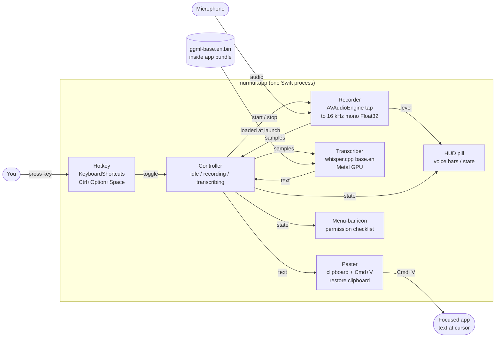
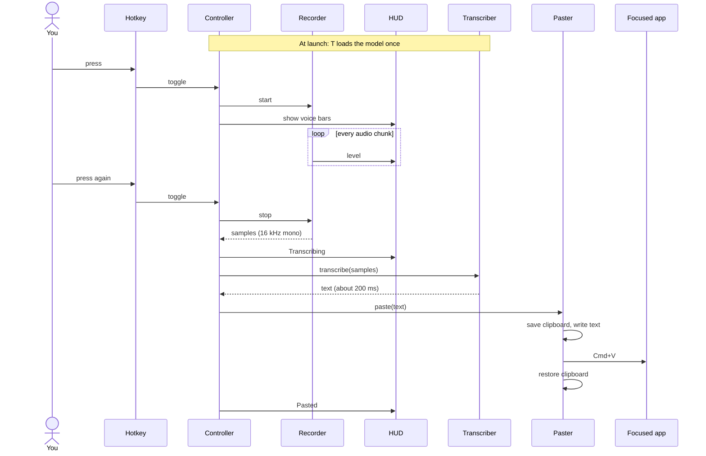
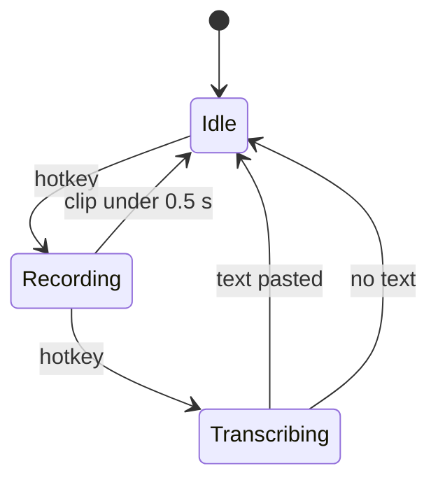
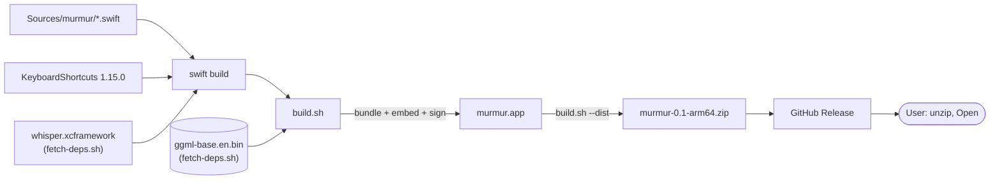
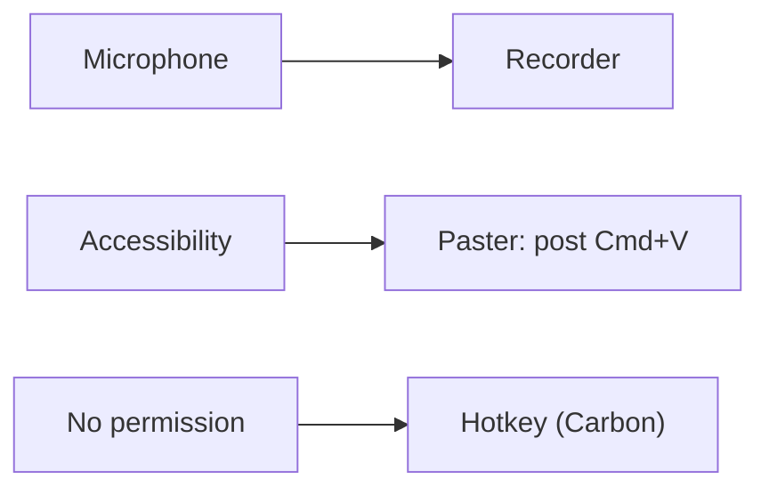

# Architecture

## System

```mermaid
flowchart LR
  subgraph APP["murmur.app (one Swift process)"]
    HK["Hotkey<br/>KeyboardShortcuts<br/>Ctrl+Option+Space"]
    CT["Controller<br/>idle / recording / transcribing"]
    RC["Recorder<br/>AVAudioEngine tap<br/>to 16 kHz mono Float32"]
    TR["Transcriber<br/>whisper.cpp base.en<br/>Metal GPU"]
    PS["Paster<br/>clipboard + Cmd+V<br/>restore clipboard"]
    HD["HUD pill<br/>voice bars / state"]
    MN["Menu-bar icon<br/>permission checklist"]
  end
  MIC(["Microphone"])
  MODEL[("ggml-base.en.bin<br/>inside app bundle")]
  TGT(["Focused app<br/>text at cursor"])
  USER(["You"])

  USER -->|press key| HK
  HK -->|toggle| CT
  CT -->|start / stop| RC
  MIC -->|audio| RC
  RC -->|level| HD
  RC -->|samples| CT
  CT -->|samples| TR
  MODEL -->|loaded at launch| TR
  TR -->|text| CT
  CT -->|text| PS
  PS -->|Cmd+V| TGT
  CT -->|state| HD
  CT -->|state| MN
```

## One dictation

```mermaid
sequenceDiagram
  actor U as You
  participant H as Hotkey
  participant C as Controller
  participant R as Recorder
  participant D as HUD
  participant T as Transcriber
  participant P as Paster
  participant A as Focused app

  Note over C,T: At launch: T loads the model once
  U->>H: press
  H->>C: toggle
  C->>R: start
  C->>D: show voice bars
  loop every audio chunk
    R->>D: level
  end
  U->>H: press again
  H->>C: toggle
  C->>R: stop
  R-->>C: samples (16 kHz mono)
  C->>D: Transcribing
  C->>T: transcribe(samples)
  T-->>C: text (about 200 ms)
  C->>P: paste(text)
  P->>P: save clipboard, write text
  P->>A: Cmd+V
  P->>P: restore clipboard
  C->>D: Pasted
```

## States

```mermaid
stateDiagram-v2
  [*] --> Idle
  Idle --> Recording: hotkey
  Recording --> Idle: clip under 0.5 s
  Recording --> Transcribing: hotkey
  Transcribing --> Idle: text pasted
  Transcribing --> Idle: no text
```

## Build and release

```mermaid
flowchart LR
  SRC["Sources/murmur/*.swift"] --> SB["swift build"]
  KS["KeyboardShortcuts 1.15.0"] --> SB
  FW["whisper.xcframework<br/>(fetch-deps.sh)"] --> SB
  SB --> BS["build.sh"]
  MD[("ggml-base.en.bin<br/>(fetch-deps.sh)")] --> BS
  BS -->|bundle + embed + sign| APP["murmur.app"]
  APP -->|build.sh --dist| ZIP["murmur-0.1-arm64.zip"]
  ZIP --> REL["GitHub Release"]
  REL --> USER(["User: unzip, Open"])
```

## Permissions

```mermaid
flowchart LR
  MICP["Microphone"] --> RC["Recorder"]
  AXP["Accessibility"] --> PS["Paster: post Cmd+V"]
  NOP["No permission"] --> HK["Hotkey (Carbon)"]
```
